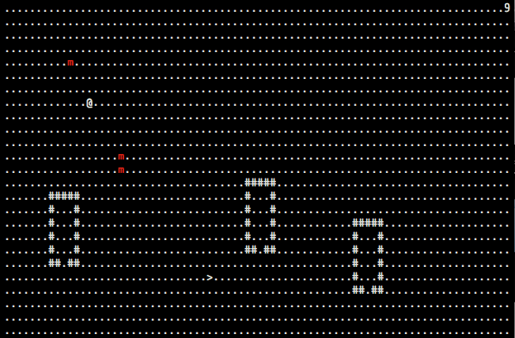

tinyRL
======

tinyRL is a tiny rogue-like written in C. 

## Playing
You will find yourself converted into a `@` in a black enviroment surrounded by evil red `m`.  
But there's hope! Run to the `>` and escape! But watch out, the `m` will chase you and will try to kill you.

Control the `@` using `hjkl` or the arrow keys. If you get bored of this game (you won't, trust me), you can exit with `ESC` or `q`.

	@..........................9 <- Your Lives
	...........#####............
	...m.......#...#............
	...........#...#............
	.....m.....#...#............
	...........#...#...>........
	...........##.##...^........
	 A house! -^       └ Exit!

## Building
Should compile on most unixes, use a terminal emulator with UTF-8 support.

	git clone https://github.com/lukasepple/tinyrl.git
	cd tinyrl
	make
	./bin/tinyrl # have fun!

## Thanks to

* [Lechindianer](https://github.com/Lechindianer) for fixing my Makefiles (although I have to fix the Makefiles again later)
* [plomlompom](https://github.com/plomlompom) who made me stumble upon roguelikes and roguelike development. And for his Informations about nearly everything.
* [vis7mac](https://github.com/vis7mac) who complains and opens issues
* [oderwat](https://github.com/oderwat) for complaining about my code style

